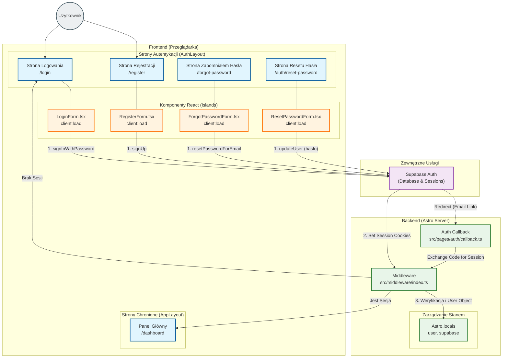

<architecture_analysis>

1. **Komponenty z plików referencyjnych:**
   - **Strony (Astro SSR):**
     - `src/pages/login.astro`
     - `src/pages/register.astro`
     - `src/pages/forgot-password.astro`
     - `src/pages/auth/reset-password.astro`
     - `src/pages/auth/callback.ts` (API Endpoint)
   - **Layouty:**
     - `src/layouts/AuthLayout.astro` (Nowy, minimalistyczny)
     - `src/layouts/AppLayout.astro` (Istniejący, chroniony)
   - **Komponenty React (Islands):**
     - `src/components/features/auth/LoginForm.tsx`
     - `src/components/features/auth/RegisterForm.tsx`
     - `src/components/features/auth/ForgotPasswordForm.tsx`
     - `src/components/features/auth/ResetPasswordForm.tsx`
   - **Backend / Middleware:**
     - `src/middleware/index.ts` (Ochrona tras, inicjalizacja Supabase SSR)
   - **Zewnętrzne:**
     - Supabase Auth (Baza danych, obsługa sesji)

2. **Główne strony i komponenty:**
   - Strona **Logowania** (`/login`) używa `AuthLayout` i zawiera `LoginForm`.
   - Strona **Rejestracji** (`/register`) używa `AuthLayout` i zawiera `RegisterForm`.
   - Strona **Odzyskiwania Hasła** (`/forgot-password`) używa `AuthLayout` i zawiera `ForgotPasswordForm`.
   - Strona **Resetu Hasła** (`/auth/reset-password`) używa `AuthLayout` i zawiera `ResetPasswordForm`.
   - **Dashboard** (`/dashboard`) używa `AppLayout` i jest dostępny tylko dla zalogowanych.

3. **Przepływ danych:**
   - Użytkownik wchodzi w interakcję z formularzami (React).
   - Formularze komunikują się bezpośrednio z **Supabase Auth** (Client-side) używając `supabase-js`.
   - Po sukcesie, Supabase ustawia ciasteczka sesyjne.
   - Następuje przekierowanie lub odświeżenie.
   - **Middleware** po stronie serwera przechwytuje żądanie, weryfikuje ciasteczka sesyjne przez `@supabase/ssr` i udostępnia obiekt `user` w `Astro.locals`.
   - Strony Astro renderują się warunkowo w zależności od stanu autentykacji (np. przekierowanie w Middleware).

4. **Opis funkcjonalności:**
   - **LoginForm**: Logowanie emailem i hasłem.
   - **RegisterForm**: Rejestracja nowego użytkownika i auto-logowanie.
   - **Middleware**: Strażnik tras (Route Guard) - blokuje dostęp do dashboardu dla niezalogowanych i dostęp do logowania dla zalogowanych.
   - **AuthLayout**: Zapewnia spójny wygląd stron autentykacji (wyśrodkowana karta, brak nawigacji aplikacji).

</architecture_analysis>

<mermaid_diagram>

</mermaid_diagram>
